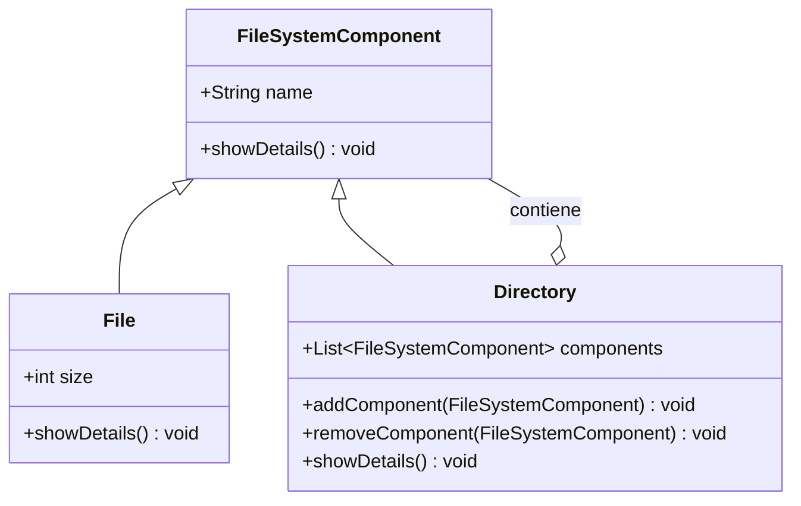

# Sistema de gestión de archivos y directorios

## Diagrama de Clase

### Explicación de cada clase

- **FileSystemComponent:** en este caso, FileSystemComponent será la clase base abstracta que se encargue de definir la estructura común para archivos y directorios. Contiene un método showDetails() que será implementado en las subclases.
- **File:** representa un archivo que tiene un nombre y un tamaño. Implementa el método showDetails() para mostrar su nombre y tamaño.
- **Directory:** representa un directorio que puede contener tanto archivos como otros directorios (hace uso de una lista de la clase FileSystemComponent). Tiene métodos para agregar y eliminar componentes y el método showDetails() que mostrará su contenido de manera recursiva.
