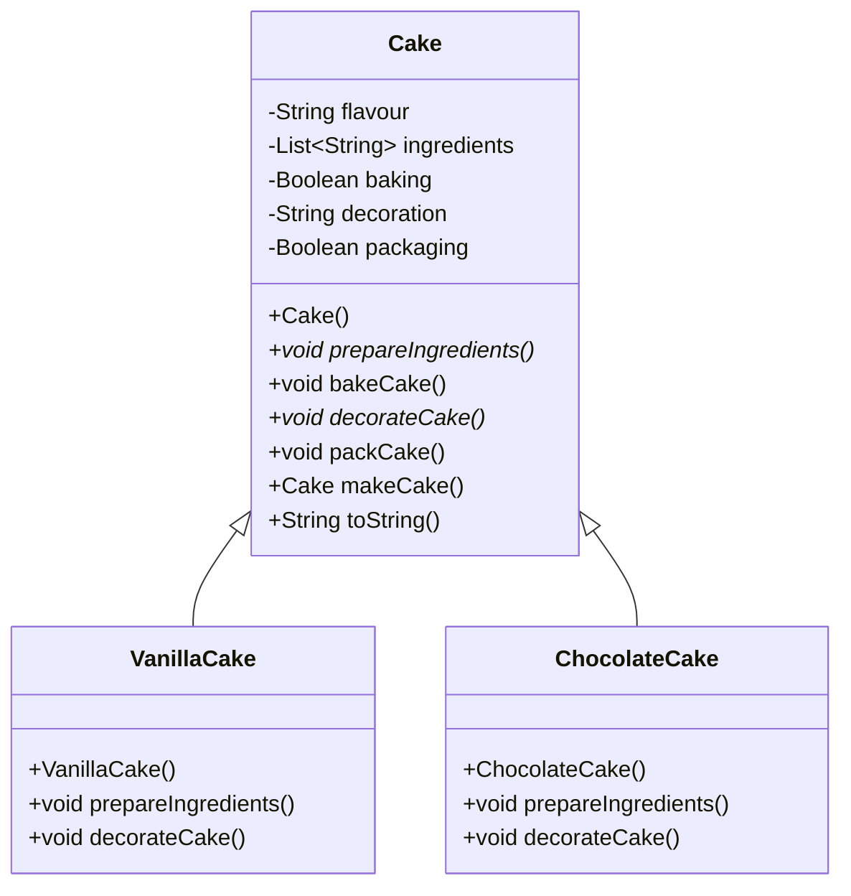

# Sistema de Creación de Pasteles

## Diagrama de Clase

## Explicación

Existe una relación de herencia entre la clase abstracta `Cake` y sus subclases concretas `VanillaCake` y `ChocolateCake`. La clase `Cake` define los atributos comunes a todos los tipos de pasteles, como **flavour (sabor)**, **ingredients (ingredientes)**, **baking (estado de horneado)**, **decoration (decoración)** y **packaging (estado de empaquetado)**.

Contiene sus métodos tanto concretos como abstractos, donde los métodos **prepareIngredients()** y **decorateCake()** están marcados como abstractos, lo que significa que deben ser implementados por las subclases `VanillaCake` y `ChocolateCake`, las cuales proporcionan sus propias implementaciones, especificando los ingredientes y la decoración correspondientes para cada tipo de pastel.
